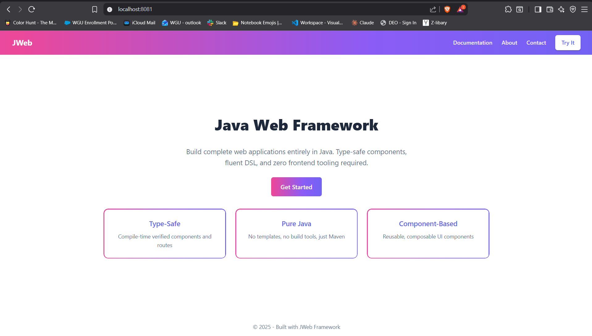

# JWeb DSL Examples: Simple to Advanced

## Required Imports
```java
import static com.osmig.Jweb.framework.elements.Elements.*;
import static com.osmig.Jweb.framework.styles.CSS.*;
import static com.osmig.Jweb.framework.styles.CSSUnits.*;
import static com.osmig.Jweb.framework.styles.CSSColors.*;
import static com.osmig.Jweb.framework.styles.MediaQuery.*;
import static com.osmig.Jweb.framework.styles.Supports.*;
import static com.osmig.Jweb.framework.state.StateHooks.*;
import static com.osmig.Jweb.framework.js.Actions.*;
```

---

## Level 1: Basic Elements

```java
// Plain text
h1("Hello World")

// With single attribute
div(id("main"), "Content here")

// Multiple attributes via shortcuts
p(class_("intro"), id("welcome"), "Welcome to JWeb!")

// Nested elements
div(
    h1("Title"),
    p("Paragraph text")
)
```

---

## Level 2: Attributes Builder

```java
// Using attrs() for multiple attributes
div(attrs().id("card").class_("card featured"),
    h2("Card Title"),
    p("Card content")
)

// Form with attributes
input(attrs()
    .type("email")
    .name("email")
    .placeholder("you@example.com")
    .required())

// Links with target blank (auto-adds rel="noopener noreferrer")
a(attrs().href("/about").targetBlank(), "About Us")
```

---

## Level 3: Inline Styles

```java
// Style via attrs().style()
div(attrs()
    .class_("box")
    .style(s -> s.padding(px(20)).backgroundColor(white)),
    p("Styled content")
)

// Fluent style chaining with .done()
div(attrs().style()
        .display(flex)
        .justifyContent(center)
        .alignItems(center)
        .gap(rem(1))
    .done(),
    span("Centered content")
)

// Direct InlineStyle usage (no .done() needed)
div(attrs().style()
        .flexCol()
        .padding(rem(2))
        .backgroundColor(hex("#f5f5f5"))
        .borderRadius(px(8)),
    h2("Card"),
    p("Content")
)
```

---

## Level 4: Collections & Conditionals

```java
// List iteration with each()
List<String> items = List.of("Apple", "Banana", "Cherry");

ul(each(items, item -> li(item)))

// Conditional rendering with when()
boolean isLoggedIn = true;

div(
    when(isLoggedIn, () -> span("Welcome back!")),
    when(!isLoggedIn, () -> a("/login", "Sign In"))
)

// If-else rendering
ifElse(isLoggedIn,
    () -> button("Logout"),
    () -> button("Login")
)

// Combining iteration with conditionals
ul(each(users, user ->
    li(
        span(user.getName()),
        when(user.isAdmin(), () -> span(class_("badge"), "Admin"))
    )
))
```

---

## Level 5: Event Handlers

```java
// Click handler
button(attrs()
    .class_("btn")
    .onClick(e -> System.out.println("Clicked!")),
    "Click Me"
)

// Form submission
form(attrs()
    .action("/submit")
    .method("POST")
    .onSubmit(e -> {
        e.preventDefault();
        handleSubmit(e.formData());
    }),
    input(attrs().type("text").name("username")),
    button(type("submit"), "Submit")
)

// Input change handler
input(attrs()
    .type("text")
    .onInput(e -> searchTerm.set(e.value()))
    .onKeyDown(e -> {
        if ("Enter".equals(e.key())) doSearch();
    })
)
```

---

## Level 6: Reactive State

```java
public class CounterPage implements Page {
    private final State<Integer> count = useState(0);

    @Override
    public Element render() {
        return div(
            h1("Counter: " + count.get()),
            button(attrs().onClick(e -> count.set(count.get() + 1)), "+"),
            button(attrs().onClick(e -> count.set(count.get() - 1)), "-"),
            button(attrs().onClick(e -> count.set(0)), "Reset")
        );
    }
}
```

---

## Level 7: Computed State & Effects

```java
public class ShoppingCart implements Page {
    private final State<List<Item>> items = useState(new ArrayList<>());
    private final State<Double> total = useComputed(
        () -> items.get().stream()
            .mapToDouble(Item::getPrice)
            .sum(),
        items  // dependency
    );

    {
        // Side effect: log when total changes
        useEffect(() -> {
            System.out.println("Total updated: $" + total.get());
        }, total);
    }

    @Override
    public Element render() {
        return div(
            h2("Shopping Cart"),
            ul(each(items.get(), item ->
                li(item.getName() + " - $" + item.getPrice())
            )),
            p(strong("Total: $" + total.get()))
        );
    }
}
```

---

## Level 8: Reusable Components

```java
// Simple component
public class Badge implements Component {
    private final String text;
    private final String color;

    public Badge(String text, String color) {
        this.text = text;
        this.color = color;
    }

    @Override
    public Element render() {
        return span(attrs().style()
                .padding(px(4), px(8))
                .borderRadius(px(4))
                .backgroundColor(hex(color))
                .color(white)
                .fontSize(rem(0.75)),
            text
        );
    }
}

// Usage
div(
    new Badge("New", "#22c55e"),
    new Badge("Sale", "#ef4444")
)
```

---

## Level 9: Component with Props & Children

```java
public class Card implements Component {
    private final String title;
    private final Element[] children;

    public Card(String title, Element... children) {
        this.title = title;
        this.children = children;
    }

    @Override
    public Element render() {
        return div(attrs().style()
                .padding(rem(1.5))
                .backgroundColor(white)
                .borderRadius(px(8))
                .boxShadow(px(0), px(2), px(8), rgba(0, 0, 0, 0.1)),
            h3(attrs().style().marginBottom(rem(1)), title),
            fragment(children)
        );
    }

    // Factory method for fluent API
    public static Card card(String title, Element... children) {
        return new Card(title, children);
    }
}

// Usage
card("User Profile",
    p("Name: John Doe"),
    p("Email: john@example.com"),
    button("Edit Profile")
)
```

---

## Level 10: Advanced Styling with CSS DSL

```java
// Stylesheet rules
String styles = styles(
    rule("*").boxSizing(borderBox),

    rule("body")
        .margin(zero)
        .fontFamily("system-ui, sans-serif")
        .backgroundColor(hex("#f8fafc")),

    rule(".btn")
        .padding(px(12), px(24))
        .border(px(0), solid, transparent)
        .borderRadius(px(6))
        .cursor(pointer)
        .transition(propAll, s(0.2), ease),

    rule(cls("btn").hover())
        .transform(translateY(px(-2)))
        .boxShadow(px(0), px(4), px(12), rgba(0, 0, 0, 0.15)),

    rule(".btn-primary")
        .backgroundColor(hex("#3b82f6"))
        .color(white),

    rule(cls("btn-primary").hover())
        .backgroundColor(hex("#2563eb"))
);

// Responsive grid
rule(".grid")
    .display(grid)
    .gridTemplateColumns(repeat(autoFill(), minmax(px(250), fr(1))))
    .gap(rem(1.5))
```

---

## Level 11: Full Interactive Page

```java
public class TodoApp implements Page {
    private final State<List<Todo>> todos = useState(new ArrayList<>());
    private final State<String> newTodo = useState("");
    private final State<String> filter = useState("all");

    @Override
    public Element render() {
        List<Todo> filtered = todos.get().stream()
            .filter(t -> switch(filter.get()) {
                case "active" -> !t.done();
                case "completed" -> t.done();
                default -> true;
            })
            .toList();

        return div(attrs().style()
                .maxWidth(px(600))
                .margin(zero, auto)
                .padding(rem(2)),

            h1(attrs().style().textCenter(), "Todo App"),

            // Input form
            form(attrs()
                .onSubmit(e -> {
                    e.preventDefault();
                    if (!newTodo.get().isBlank()) {
                        todos.update(list -> {
                            list.add(new Todo(newTodo.get()));
                            return list;
                        });
                        newTodo.set("");
                    }
                }),
                div(attrs().style().display(flex).gap(rem(0.5)),
                    input(attrs()
                        .type("text")
                        .value(newTodo.get())
                        .placeholder("What needs to be done?")
                        .onInput(e -> newTodo.set(e.value()))
                        .style(s -> s.flex(1, 1, auto).padding(px(12)))),
                    button(type("submit"), "Add")
                )
            ),

            // Filter buttons
            div(attrs().style().display(flex).gap(rem(0.5)).marginY(rem(1)),
                filterBtn("all", "All"),
                filterBtn("active", "Active"),
                filterBtn("completed", "Completed")
            ),

            // Todo list
            ul(attrs().style().listStyle(none).padding(zero),
                each(filtered, todo ->
                    li(attrs().style()
                            .display(flex)
                            .alignItems(center)
                            .padding(rem(0.75))
                            .borderBottom(px(1), solid, hex("#e5e7eb")),
                        input(attrs()
                            .type("checkbox")
                            .checked(todo.done())
                            .onChange(e -> toggleTodo(todo))),
                        span(attrs().style()
                                .flex(1, 1, auto)
                                .marginLeft(rem(0.75))
                                .textDecoration(todo.done() ? lineThrough : none),
                            todo.text()),
                        button(attrs()
                            .onClick(e -> removeTodo(todo))
                            .style(s -> s.color(red).cursor(pointer)),
                            "x")
                    )
                )
            ),

            // Footer
            p(attrs().style().color(gray).fontSize(rem(0.875)),
                filtered.size() + " items")
        );
    }

    private Element filterBtn(String value, String label) {
        boolean active = filter.get().equals(value);
        return button(attrs()
            .onClick(e -> filter.set(value))
            .style(s -> s
                .padding(px(8), px(16))
                .border(px(1), solid, active ? hex("#3b82f6") : hex("#d1d5db"))
                .backgroundColor(active ? hex("#3b82f6") : white)
                .color(active ? white : hex("#374151"))
                .borderRadius(px(4))
                .cursor(pointer)),
            label
        );
    }

    private void toggleTodo(Todo todo) {
        todos.update(list -> {
            list.stream()
                .filter(t -> t.equals(todo))
                .forEach(t -> t.setDone(!t.done()));
            return list;
        });
    }

    private void removeTodo(Todo todo) {
        todos.update(list -> {
            list.remove(todo);
            return list;
        });
    }
}
```

---

## Level 12: Templates with Layout

```java
public class MainLayout implements Template {
    @Override
    public Element render(Element... content) {
        return html(
            head(
                title("My App"),
                meta("viewport", "width=device-width, initial-scale=1"),
                css("/styles.css")
            ),
            body(attrs().style()
                    .minHeight(vh(100))
                    .display(flex)
                    .flexDirection(column),

                // Header
                header(attrs().style()
                        .padding(rem(1))
                        .backgroundColor(hex("#1e293b"))
                        .color(white),
                    nav(attrs().style().flexBetween().maxWidth(px(1200)).margin(zero, auto),
                        a(attrs().href("/").style().color(white).textDecoration(none),
                            strong("MyApp")),
                        div(attrs().style().display(flex).gap(rem(1)),
                            a("/features", "Features"),
                            a("/pricing", "Pricing"),
                            a("/about", "About")
                        )
                    )
                ),

                // Main content
                main(attrs().style().flex(1, 1, auto).padding(rem(2)),
                    div(attrs().style().maxWidth(px(1200)).margin(zero, auto),
                        fragment(content)
                    )
                ),

                // Footer
                footer(attrs().style()
                        .padding(rem(2))
                        .backgroundColor(hex("#f1f5f9"))
                        .textAlign(center),
                    p("© 2024 MyApp. All rights reserved.")
                )
            )
        );
    }
}

// Usage in a Page
public class HomePage implements Page {
    @Override
    public Element render() {
        return new MainLayout().render(
            section(
                h1("Welcome to MyApp"),
                p("Build amazing web applications with Java.")
            )
        );
    }
}
```

---

---

## Level 13: Form Input Builders

```java
// Type-safe form inputs
form(attrs().id("register-form"),
    // Text inputs with validation
    field("Username",
        textInput("username")
            .id("username")
            .required()
            .minLength(3)
            .maxLength(20)
            .pattern("[a-zA-Z0-9_]+")
            .autocomplete("username")
    ),

    field("Email",
        emailInput("email")
            .id("email")
            .required()
            .placeholder("you@example.com")
    ),

    field("Password",
        passwordInput("password")
            .id("password")
            .required()
            .minLength(8),
        "Must be at least 8 characters"
    ),

    // Number input with range
    field("Age",
        numberInput("age")
            .min(18)
            .max(120)
            .required()
    ),

    // Selection inputs
    div(attrs().style().marginBottom(rem(1)),
        checkbox("terms", "I agree to the terms"),
        checkbox("newsletter", "Subscribe to newsletter")
    ),

    // Radio group
    div(attrs().style().marginBottom(rem(1)),
        p("Select plan:"),
        radio("plan", "free", "Free Plan"),
        radio("plan", "pro", "Pro Plan"),
        radio("plan", "enterprise", "Enterprise Plan")
    ),

    // Date inputs
    field("Start Date", dateInput("startDate")),
    field("Preferred Time", timeInput("preferredTime")),

    // Hidden field for CSRF
    hiddenInput("_csrf", csrfToken),

    button(type("submit"), "Register")
)
```

---

## Level 14: Batch Classes & Conditional Styling

```java
// Multiple classes with classes()
div(classes("card", "shadow", "rounded"),
    h2("Card Title"),
    p("Card content")
)

// Conditional classes
boolean isActive = true;
boolean isDisabled = false;
boolean isPrimary = true;

button(
    classes(
        "btn",
        isActive ? "active" : null,
        isDisabled ? "disabled" : null,
        isPrimary ? "btn-primary" : "btn-secondary"
    ),
    "Click Me"
)

// Using class_() with condition
div(
    class_("notification"),
    class_("success", isSuccess),
    class_("error", isError),
    class_("warning", isWarning),
    class_("animate", shouldAnimate),
    span(message)
)

// Complex conditional styling
List<String> items = getItems();
div(
    class_("list"),
    class_("empty", items.isEmpty()),
    class_("single", items.size() == 1),
    class_("multiple", items.size() > 1),
    each(items, item -> li(item))
)
```

---

## Level 15: CSS Feature Queries (@supports)

```java
// Progressive enhancement with @supports
String styles = styles(
    // Base flexbox layout
    rule(".container")
        .display(flex)
        .flexWrap(wrap)
        .gap(rem(1)),

    // Grid enhancement if supported
    supports("display", "grid")
        .rule(".container", style()
            .display(grid)
            .gridTemplateColumns(repeat(autoFill(), minmax(px(250), fr(1))))
            .gap(rem(1.5)))
        .build(),

    // Subgrid for complex layouts
    supportsSelector(":has(> img)")
        .rule(".card:has(> img)", style()
            .padding(zero)
            .overflow(hidden))
        .build(),

    // Container queries
    supportsContainerQueries()
        .rule(".card", style()
            .containerType(inlineSize))
        .build(),

    // Backdrop filter for glassmorphism
    supportsBackdropFilter()
        .rule(".glass-panel", style()
            .backdropFilter("blur(10px)")
            .backgroundColor(rgba(255, 255, 255, 0.1)))
        .build(),

    // Multiple conditions
    supports()
        .property("display", "grid")
        .and()
        .property("gap", "1rem")
        .rule(".modern-grid", style()
            .display(grid)
            .gap(rem(1)))
        .build()
);
```

---

## Level 16: Nested CSS

```java
// Modern CSS nesting syntax
String styles = nested(".card")
    .prop("padding", "1.5rem")
    .prop("background", "#fff")
    .prop("border-radius", "12px")
    .prop("box-shadow", "0 2px 8px rgba(0,0,0,0.1)")

    // Hover state
    .hover()
        .prop("transform", "translateY(-4px)")
        .prop("box-shadow", "0 8px 24px rgba(0,0,0,0.15)")
    .end()

    // Focus state
    .focus()
        .prop("outline", "2px solid #3b82f6")
        .prop("outline-offset", "2px")
    .end()

    // Child elements
    .child(".title")
        .prop("font-size", "1.25rem")
        .prop("font-weight", "600")
        .prop("margin-bottom", "0.5rem")
    .end()

    .child(".content")
        .prop("color", "#6b7280")
        .prop("line-height", "1.6")
    .end()

    // Direct child
    .direct(".icon")
        .prop("width", "24px")
        .prop("height", "24px")
    .end()

    // Modifier classes
    .and(".featured")
        .prop("border", "2px solid #10b981")
        .prop("background", "#f0fdf4")
    .end()

    .and(".disabled")
        .prop("opacity", "0.5")
        .prop("pointer-events", "none")
    .end()

    // Pseudo-elements
    .before()
        .prop("content", "''")
        .prop("position", "absolute")
        .prop("inset", "0")
    .end()

    .build();
```

---

## Level 17: JavaScript Actions DSL

```java
// Building JavaScript with type-safe DSL
public class DashboardScripts {
    public static String dashboardHandlers() {
        return script()
            .withHelpers()                    // Include helper functions

            // State management
            .state(state()
                .var("isLoading", false)
                .var("currentUser", "null")
                .array("notifications")
                .var("theme", "\"light\""))

            // DOM references
            .refs(refs()
                .add("sidebar", "sidebar-panel")
                .add("content", "main-content")
                .add("modal", "modal-overlay"))

            // Toggle sidebar
            .add(windowFunc("toggleSidebar")
                .does(
                    toggle("sidebar-panel"),
                    toggleClass("main-content", "sidebar-open")
                ))

            // Load data with fetch
            .add(asyncFunc("loadDashboard")
                .does(
                    assignVar("isLoading", "true"),
                    fetch("/api/dashboard")
                        .headerFromVar("Authorization", "token")
                        .ok(all(
                            assignVar("currentUser", "_data.user"),
                            assignVar("notifications", "_data.notifications"),
                            call("renderDashboard")
                        ))
                        .fail(call("showError", "'Failed to load'")),
                    assignVar("isLoading", "false")
                ))

            // Form handling
            .add(onSubmit("settings-form")
                .loading("Saving...")
                .before(hide("error-message"))
                .post("/api/settings")
                .body("new FormData(e.target)")
                .ok(all(
                    alertModal("modal", "modalBody")
                        .success("Settings saved!"),
                    call("loadDashboard")
                ))
                .fail(responseError("error-message")
                    .on400("Invalid settings")
                    .otherwise("Server error")))

            // Event listeners
            .add(onEvent("click").on("modal").then(hideOnBackdropClick("modal")))
            .add(onEvent("keydown").when("e.key==='Escape'").then(hideModal("modal")))

            .build();
    }
}
```

---

## Level 18: Async/Await & Fetch Builder

```java
// Async operations with proper error handling
.add(asyncFunc("submitOrder")
    .params("orderId")
    .does(
        // Show loading state
        setText("status", "Processing order..."),
        show("loading-spinner"),

        // Async try-catch
        asyncTry(
            // Validate first
            await_(fetch("/api/orders/" + "orderId" + "/validate")
                .headerFromVar("X-Auth", "authToken")
                .ok(noop())
                .fail(throwError("'Validation failed'"))),

            // Process payment
            await_(fetch("/api/payments")
                .post()
                .headerFromVar("X-Auth", "authToken")
                .body("{orderId: orderId}")
                .ok(assignVar("paymentId", "_data.id"))
                .fail(throwError("'Payment failed'"))),

            // Confirm order
            await_(fetch("/api/orders/" + "orderId" + "/confirm")
                .post()
                .body("{paymentId: paymentId}")
                .ok(all(
                    setText("status", "Order confirmed!"),
                    call("refreshOrders")
                )))
        ).catch_("error",
            setText("status", "Error: \" + error.message + \""),
            logError("error")
        ).finally_(
            hide("loading-spinner")
        ),

        // Parallel requests with promiseAll
        promiseAll(
            fetch("/api/user").ok(assignVar("user", "_data")),
            fetch("/api/settings").ok(assignVar("settings", "_data")),
            fetch("/api/notifications").ok(assignVar("notifs", "_data"))
        ),

        // Delay
        sleep(1000),
        call("showWelcome")
    ))
```

---

## Level 19: DOM Query Builder

```java
// Type-safe DOM queries
.add(define("updateUI")
    .does(
        // Single element query
        query("#status-text")
            .setText("Updated!")
            .addClass("success")
            .show(),

        // Query with attribute
        query("[data-tab='active']")
            .removeClass("hidden")
            .addClass("visible"),

        // Multiple elements
        queryAll(".notification")
            .forEach(el ->
                el.addClass("fade-out")
                  .hide()),

        // Chained operations
        query("#user-panel")
            .removeClass("loading")
            .addClass("loaded")
            .attr("data-ready", "true")
            .show("flex"),

        // Query with action
        queryAll(".btn")
            .forEach(el ->
                el.onClick(call("handleClick", "el.id")))
    ))
```

---

## Level 20: Template Lifecycle Hooks

```java
public class AdvancedPage implements Template {
    private final UserService userService;
    private User user;
    private List<Notification> notifications;

    // Called before render - setup data
    @Override
    public void beforeRender(HttpRequest request) {
        user = userService.getCurrentUser(request);
        notifications = userService.getNotifications(user.getId());
    }

    // Called after render - cleanup
    @Override
    public void afterRender(HttpRequest request) {
        // Mark notifications as seen
        userService.markNotificationsSeen(user.getId());
    }

    // Page title for <title> tag
    @Override
    public String pageTitle() {
        return user != null ? "Dashboard - " + user.getName() : "Dashboard";
    }

    // Meta description for SEO
    @Override
    public String metaDescription() {
        return "Your personal dashboard with " + notifications.size() + " notifications";
    }

    // Additional head elements
    @Override
    public Element extraHead() {
        return fragment(
            link(attrs().rel("preconnect").href("https://fonts.googleapis.com")),
            meta(attrs().name("robots").content("noindex")),
            style(customStyles())
        );
    }

    // Scripts to include before </body>
    @Override
    public Element scripts() {
        return fragment(
            script(attrs().src("/js/dashboard.js").defer()),
            script(inlineScripts())
        );
    }

    // Enable caching
    @Override
    public boolean cacheable() {
        return false;  // User-specific content
    }

    @Override
    public Element render() {
        return div(class_("dashboard"),
            header(
                h1("Welcome, " + user.getName()),
                span(class_("notification-badge"), String.valueOf(notifications.size()))
            ),
            main(
                each(notifications, n -> notificationCard(n))
            )
        );
    }

    // Client-side mount/unmount hooks (for script generation)
    @Override
    public String onMount() {
        return "console.log('Dashboard mounted'); initDashboard();";
    }

    @Override
    public String onUnmount() {
        return "console.log('Dashboard unmounting'); cleanup();";
    }
}
```

---

## Summary Table

| Level | Features |
|-------|----------|
| 1 | Basic elements, text, nesting |
| 2 | `attrs()` builder, form attributes |
| 3 | Inline styles with `style()` |
| 4 | `each()`, `when()`, `ifElse()` |
| 5 | Event handlers (`onClick`, `onSubmit`) |
| 6 | Reactive `useState()` |
| 7 | `useComputed()`, `useEffect()` |
| 8 | Reusable `Component` classes |
| 9 | Components with props & children |
| 10 | CSS DSL: `rule()`, selectors, transitions |
| 11 | Full interactive pages |
| 12 | Templates with layouts |
| 13 | Form input builders (`textInput`, `emailInput`, `field`) |
| 14 | Batch classes & conditional styling (`classes()`, `class_(name, condition)`) |
| 15 | CSS feature queries (`@supports`) |
| 16 | Nested CSS with pseudo-selectors |
| 17 | JavaScript Actions DSL (`script()`, `state()`, `refs()`) |
| 18 | Async/Await & Fetch Builder |
| 19 | DOM Query Builder (`query()`, `queryAll()`) |
| 20 | Template Lifecycle Hooks |
